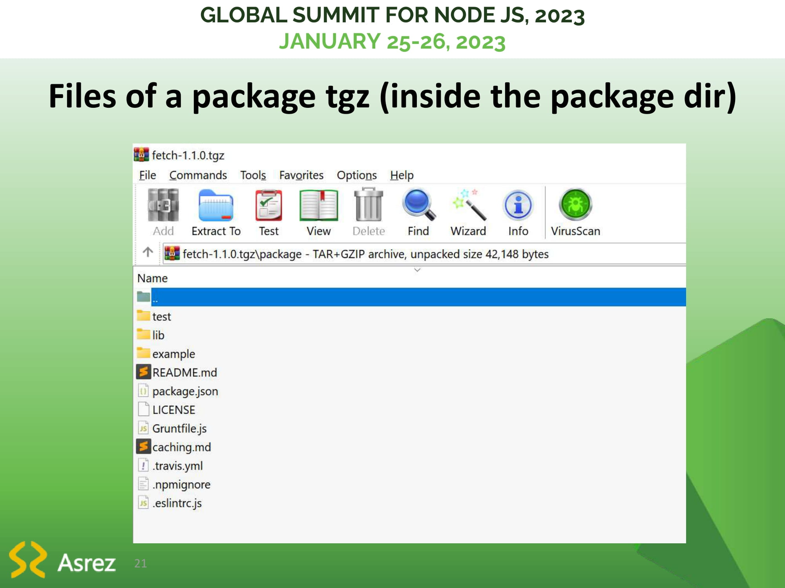

# How NPM or Yarn are working; Going to create our own package manager

## Global Summit for NodeJS 2023

Global Summit for Node.js'23 (JANUARY 25-26, 2023)

> I published the project that was worked on in this talk at https://github.com/BaseMax/MyNodePackageManager. Feel free to check, download, star, and share.

Event website: https://events.geekle.us/nodejs2/ and https://geekle.us/schedule/nodejs23

## Slides

Copyright (c) 2022, Max Base
